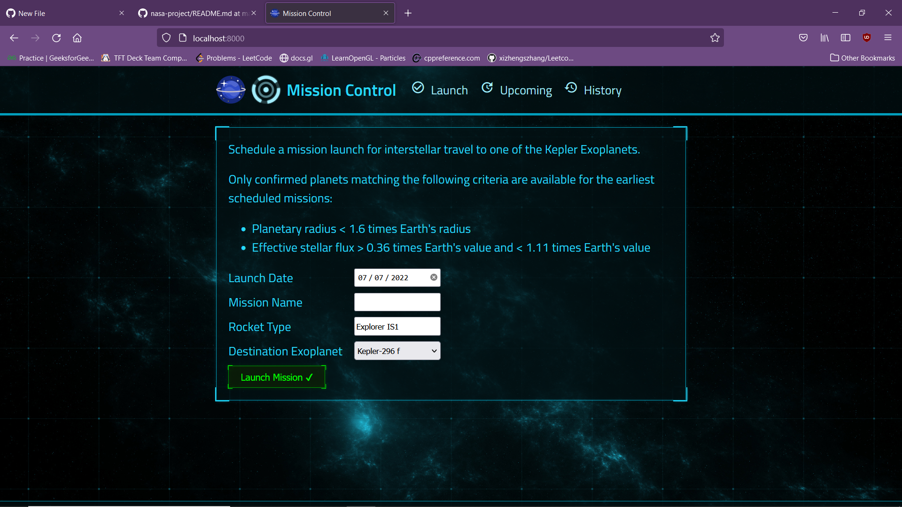
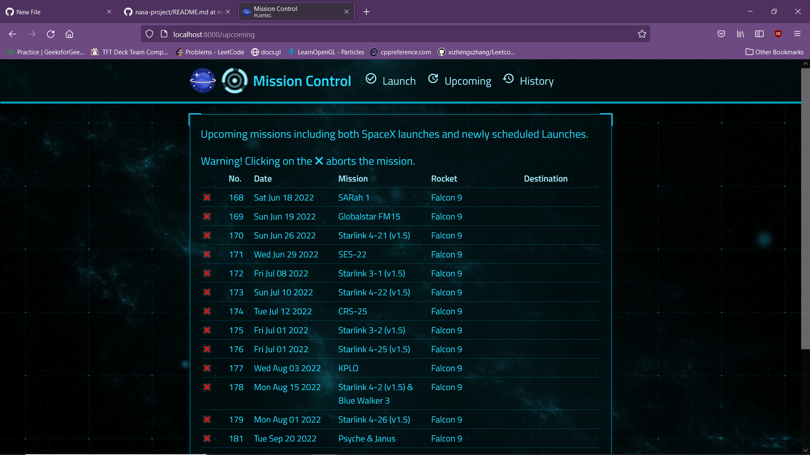
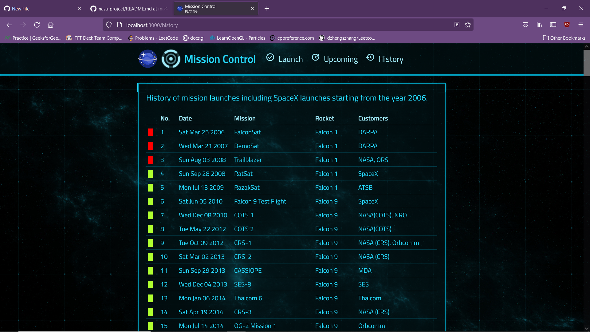

# Space-Project

## Running the project
1. In the terminal, run: npm install
1. Then, run: `npm run deploy`
2. Browse to the mission control frontend at [localhost:8000](http://localhost:8000) and schedule an interstellar launch!

## Project Overview

1. Dashboard

2. Upcoming launches

3. History of launches

